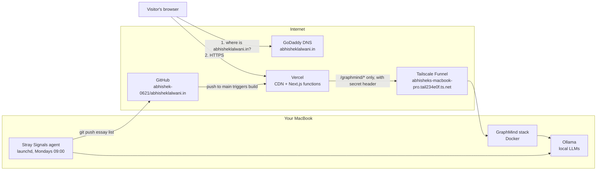
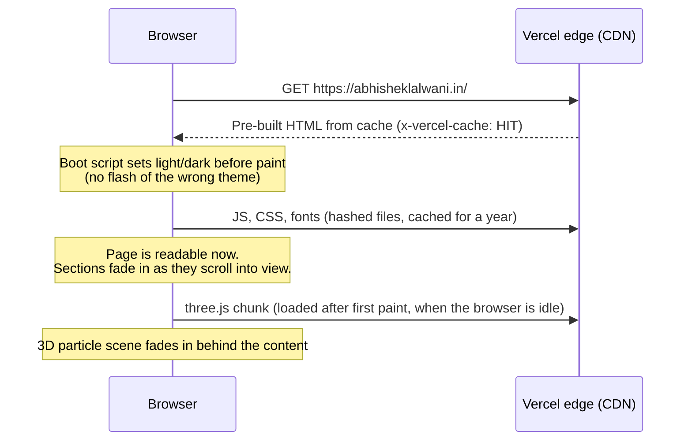
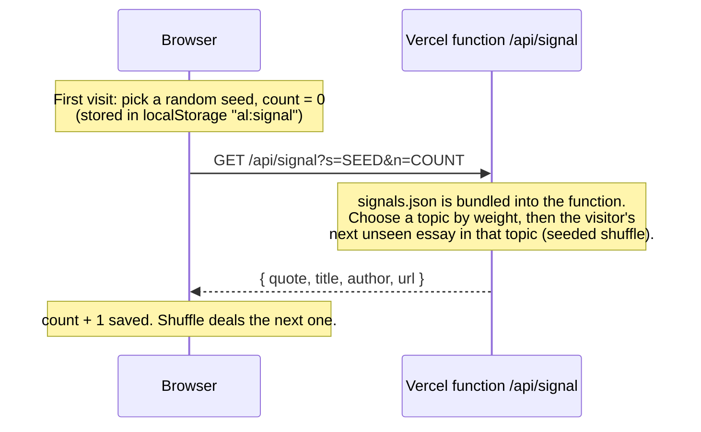
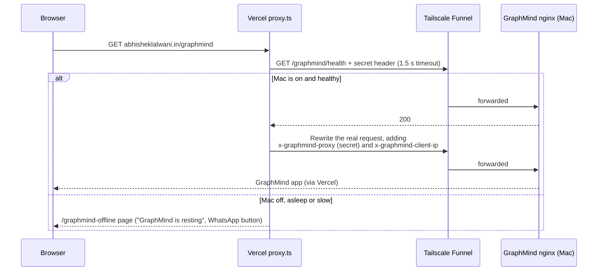
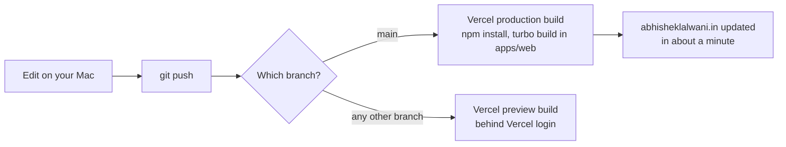
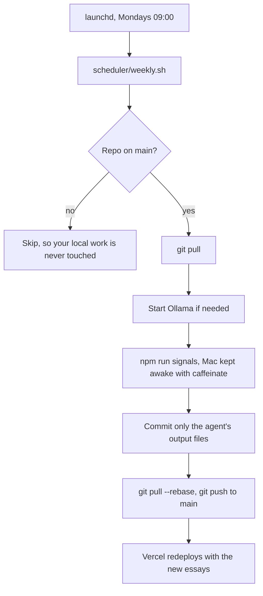

# How abhisheklalwani.in works

This is the whole system in one place: what runs where, what happens when someone opens the site, how a change gets to production, and how GraphMind and Stray Signals plug in. Read it top to bottom once and you should be able to explain every hop.

Total hosting cost: **$0/month** (Vercel Hobby, Tailscale free, your own Mac). The only paid item is the domain on GoDaddy.

---

## 1. The big picture



There are three moving parts:

| Part | Where it runs | What it does |
|---|---|---|
| **Portfolio** (`apps/web`) | Vercel | Every page of the site, the 3D background, the `/api/signal` endpoint, and the proxy to GraphMind. |
| **GraphMind** | Your Mac, in Docker | The live app at `/graphmind`. Reached only through the portfolio. |
| **Stray Signals agent** (`agents/stray-signals`) | Your Mac, weekly | Finds and judges Substack essays with Ollama, then commits the list to GitHub. |

---

## 2. The repository

A Turborepo monorepo with npm workspaces.

```
apps/web/                    The Next.js 16 site (the only thing Vercel builds)
  src/app/                   Routes (App Router)
    page.tsx                 Home: hero, about, work, experience, contact
    work/                    /work and /work/[slug] (case studies from MDX)
    api/signal/route.ts      Stray Signals endpoint
    graphmind-offline/       Page shown when the Mac is off
    layout.tsx               Shell on every page: fonts, theme boot, 3D scene, nav, footer
  src/proxy.ts               Runs before /graphmind requests (Next 16's name for middleware)
  src/components/
    scene/                   The WebGL particle background (three.js)
    sections/                Home page sections
    signal/                  The Stray Signals easter egg UI
    ui/                      Nav, primitives, theme toggle, reveal observer
  src/content/               All copy and data: site.ts, projects.ts, work/*.mdx, signals.json
  public/resume.pdf
packages/ui/                 @al/ui: design tokens (tokens.css), the thinking-orbs loader, cn()
agents/stray-signals/        The weekly essay agent (TypeScript, runs with tsx)
turbo.json                   Build pipeline; lists env vars the build may see
```

**Rule of thumb:** words and data live in `apps/web/src/content/`, looks live in `packages/ui/src/tokens.css` and `apps/web/src/app/globals.css`.

---

## 3. Domain and DNS

The domain is registered at GoDaddy, and GoDaddy's nameservers (`ns71/ns72.domaincontrol.com`) answer for it.

| Record | Name | Points to | Why |
|---|---|---|---|
| A | `@` (abhisheklalwani.in) | Vercel's IP (currently `216.198.79.1`) | The main site |
| CNAME | `www` | `…vercel-dns-017.com` | So www works too |

In Vercel, `abhisheklalwani.in` is the **primary** domain and `www` answers with a **308 redirect** to it, so there is one canonical address. Vercel issues and renews the HTTPS certificate automatically and sends `Strict-Transport-Security`, so browsers always use HTTPS.

---

## 4. What happens when someone opens the site

### 4.1 A normal page (for example the home page)



- **Pages are static.** At build time Next.js renders `/`, `/work`, each case study, the sitemap and so on into HTML. Vercel serves those straight from its CDN, so there is no server work per visit. Only `/api/signal` and anything under `/graphmind` run code per request.
- **Theme:** a tiny inline script in `<head>` reads your saved choice (`localStorage al:theme`) or the system setting and sets `data-theme` on `<html>` before anything paints. Colour tokens in `packages/ui/src/tokens.css` switch on that attribute.
- **Scroll reveals:** one shared IntersectionObserver (`reveal-observer.tsx`) adds `data-in` to `.reveal` elements as they enter the screen; CSS does the fade and lift.

### 4.2 The 3D background

One WebGL canvas is mounted once in `layout.tsx` and survives page changes.

- `scene/scene-root.tsx` checks the device first. With reduced motion turned on, or no WebGL, there is no scene at all. Otherwise it picks a particle count (4,200 on phones, 6,000 on 4-core machines, 9,000 elsewhere) and loads the three.js code after the page is interactive. A thinking orb holds the spot while it loads.
- `scene/shapes.ts` pre-computes six shapes for the same particles: 0 big bang, 1 galaxy, 2 neural network, 3 warp tunnel, 4 orb with rings, 5 knowledge graph.
- Every page section declares its shape with `<Section scene={n}>`, which renders `data-scene="n"`. `particle-canvas.tsx` measures where those sections are, turns your scroll position into a number between 0 and 5, and the vertex shader (`shaders.ts`) blends the particles between shapes. So scrolling from About to Work literally morphs the galaxy into the neural net.
- Colours come from the same CSS tokens, re-read when the theme changes.

### 4.3 Stray Signals (the easter egg)



There is **no database**. The server is stateless: the same seed and count always give the same essay, and each visitor has their own seed, so people see different orders and nobody sees a repeat until they have been through the whole library. Topic weights live in `TOPIC_WEIGHTS` in `agents/stray-signals/src/schema.ts`. Add `?signal` to any URL to make the signal appear straight away.

### 4.4 GraphMind at /graphmind

GraphMind runs on your Mac. The portfolio is the only door to it.



Step by step (`apps/web/src/proxy.ts`):

1. Only paths under `/graphmind` reach the proxy (its `matcher`). Everything else skips it.
2. If `GRAPHMIND_ORIGIN` or `GRAPHMIND_PROXY_SECRET` is missing, page loads get the offline page and API calls get `503`.
3. For **page loads** it first calls `/graphmind/health` on the Mac with a 1.5 s timeout. No answer means the offline page. The address in the browser stays `/graphmind`, so a reload tries again.
4. Otherwise it **rewrites** the request to `https://abhisheks-macbook-pro.tail234e0f.ts.net/graphmind/...`. Vercel fetches it and streams the answer back, so the visitor never sees the ts.net address. A bare `/graphmind` is sent as `/graphmind/` because the app is served from that folder.
5. Every forwarded request carries two headers:
   - `x-graphmind-proxy`: the shared secret. GraphMind's nginx returns **404** to anything without the exact value, so the public ts.net address is useless on its own.
   - `x-graphmind-client-ip`: the visitor's real IP (from Vercel's `x-forwarded-for`), trusted only alongside the secret, so per-visitor rate limits work.
6. Asset and API calls skip the health check (one check per page load is enough), and nothing under `/graphmind` is cached, so chat answers stream live. A 30-second streamed answer has been tested and works.

**One exception to "Vercel is the only door":** file uploads go from the visitor's browser straight to the Mac on port 8443 (Funnel), using short-lived presigned links from GraphMind's storage. The signature in each link is its own lock, and only the bucket paths are served there.

The Mac side (Docker containers, nginx secret gate, Funnel config, RAM and image sizes) is documented in the GraphMind hosting audit and managed from the GraphMind repo (`~/Desktop/graph-extractor-platform`, `scripts/public-*.sh`).

---

## 5. How a change goes live



- Vercel watches the GitHub repo. The project's **Root Directory is `apps/web`**; Vercel installs the whole workspace and builds with Turborepo, which builds `@al/ui` first.
- A push to `main` is a production deploy. A push to any other branch (for example `feature/journey-freelance`) makes a **preview** at a `*.vercel.app` address. Previews sit behind Vercel's login (Deployment Protection), which is why opening one in a logged-out browser shows a sign-in wall and manifest errors in the console.
- If a build fails, the previous production version keeps serving. Nothing half-deploys.
- Rolling back: Vercel dashboard, Deployments, pick an older one, "Promote to Production". Or `git revert` and push.

### Environment variables (Vercel, Production)

| Name | Value | Used by |
|---|---|---|
| `GRAPHMIND_ORIGIN` | `https://abhisheks-macbook-pro.tail234e0f.ts.net` | `proxy.ts` |
| `GRAPHMIND_PROXY_SECRET` | the secret in `~/.config/graphmind/proxy-secret` on the Mac | `proxy.ts` |

They are read when a request arrives, not baked into the build. `turbo.json` lists them in `passThroughEnv` so Turborepo doesn't hide them. After changing one in Vercel, **redeploy**; a running deployment keeps the old values.

---

## 6. The weekly Stray Signals run



What `npm run signals` does (`agents/stray-signals/src/run.ts`):

1. **Collect:** RSS feeds and each publication's most-liked archive posts.
2. **Discover:** new publications through Substack's recommendation graph and category leaderboards, screened by the model.
3. **Guard:** skip posts dense with tech or politics terms.
4. **Curate:** the local model (`phi4:14b` by default) scores originality, depth, craft, timelessness and quotability, assigns a topic and picks a quote.
5. **Verify:** the quote must appear word for word in the essay.
6. **Select:** balance topics and publications, then write `apps/web/src/content/signals.json` and `signals-meta.json`.

Verdicts are cached in `agents/stray-signals/data/` and **never deleted**, so the library only grows and each week only new posts cost model time.

**Watch out:** the job only runs when this checkout is on `main`. If you leave the repo on a feature branch over a Monday, that week is skipped (the log says so). The log is `~/Library/Logs/stray-signals.log`; `npm run signals:uninstall` turns the schedule off.

---

## 7. Security, in one list

- **HTTPS everywhere:** Vercel certificates for the site, HSTS for two years, Tailscale certificates for the Funnel.
- **Headers on every page** (`next.config.ts`): `X-Content-Type-Options: nosniff`, `Referrer-Policy: strict-origin-when-cross-origin`, a `Permissions-Policy` that turns off camera, microphone and location. The `X-Powered-By` header is removed.
- **No secrets in the browser or the repo.** The proxy secret exists only in Vercel's environment and one file on the Mac.
- **The Mac is not reachable from the internet** except the two Funnel ports GraphMind publishes (443 through the secret gate, 8443 for signed uploads). Direct requests without the secret get 404. Databases, Ollama and everything else listen on 127.0.0.1 only.
- **Draft pages** (`/journey`, `/freelance` on the feature branch) are `noindex` and not linked until finished.

---

## 8. What to do when…

| Situation | Do this |
|---|---|
| Change text, projects or links | Edit `apps/web/src/content/`, push to `main`. |
| Add a case study | Entry in `content/projects.ts` plus `content/work/<slug>.mdx`. Cards, routes and sitemap follow. |
| Replace the résumé | Overwrite `apps/web/public/resume.pdf`. The download name is set in `next.config.ts` and `site.ts`. |
| Change the accent colour | `--color-accent` in `packages/ui/src/tokens.css` (and the light-theme block below it). The 3D scene follows. |
| `/graphmind` shows "resting" but the Mac is on | Is Docker's GraphMind stack up? Run the GraphMind repo's `scripts/public-smoke-test.sh`. Is Tailscale connected? Did the Mac sleep? |
| Rotated the GraphMind secret | Update `GRAPHMIND_PROXY_SECRET` in Vercel, then redeploy. |
| Stray Signals didn't update | Check the Monday log; was the repo on `main`, was the Mac awake? Run `npm run signals` by hand. |
| Something broke after a deploy | Vercel, Deployments, promote the previous one. Then fix and push. |
| Domain stops resolving | Check the A and CNAME records in GoDaddy DNS match what Vercel's Domains page asks for. |

---

## 9. Local development

```bash
npm install
npm run dev                      # http://localhost:3000
npm run build                    # the same build Vercel runs
npx tsc --noEmit -p apps/web     # type check
```

Locally, `/graphmind` shows the offline page unless you set `GRAPHMIND_ORIGIN` and `GRAPHMIND_PROXY_SECRET` in `apps/web/.env.local`.
