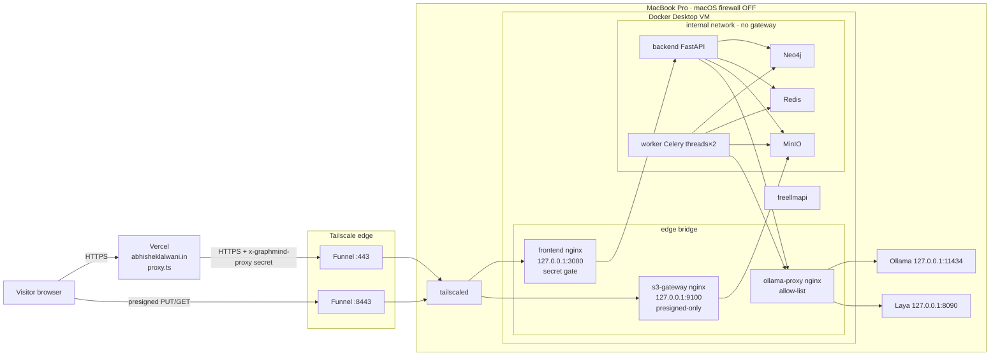
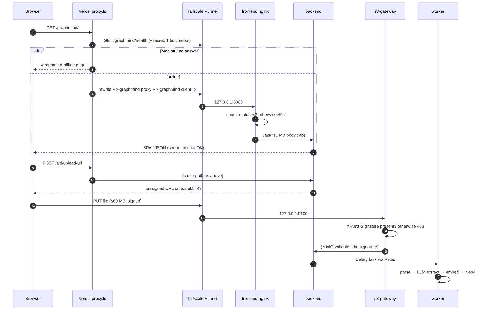
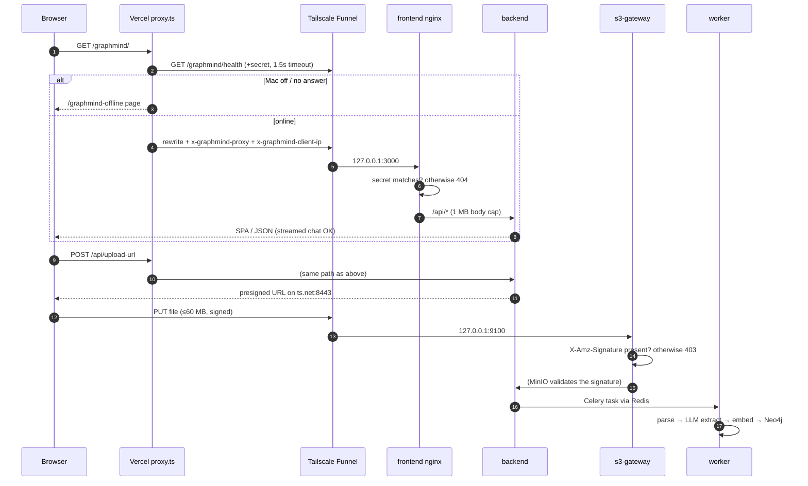
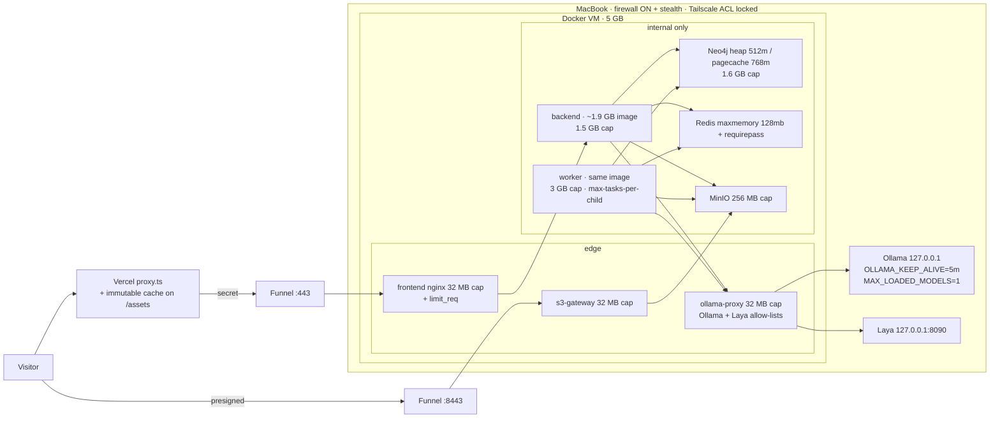
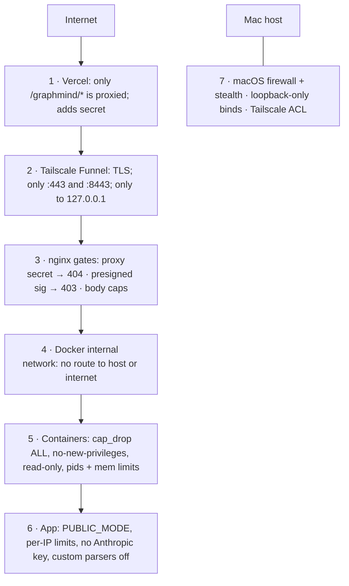

# GraphMind hosting: audit, architecture, and optimisation plan

_Audit date: 2026-09-27 (re-audited the same day after GraphMind #260–#272)._ _Original scope: Scope: every container running in Docker Desktop on the MacBook Pro, the Tailscale Funnel, and the Vercel proxy in this repo (`apps/web/src/proxy.ts`)._

**Goals**

1. Make builds and deploys faster.
2. Keep hosting at $0/month.
3. Make the images smaller.
4. Use less RAM.
5. Keep `abhisheklalwani.in/graphmind` public on the internet while leaving no route from the internet into the Mac.

**Constraint:** change as little application code as possible. Everything below is Dockerfile, compose, runtime flags, or host settings. The GraphMind repo (`~/Desktop/graph-extractor-platform`) is maintained by a separate agent, so the changes to it are packaged as a paste-ready prompt in [§9](#9-paste-ready-prompt-for-the-graphmind-agent).

---

## 1. What runs today (re-measured 2026-09-27, after GraphMind #260–#272)

Host: 24 GB MacBook Pro. The Docker Desktop VM has 7.75 GB of RAM and 15 CPUs.

| Container | Image (size) | RAM now | Limit | Published on |
|---|---|---|---|---|
| graphmind-backend-1 | graphmind-backend (**3.69 GB**, was 5.47) | 578 MB | 2 GB | none (internal network) |
| graphmind-worker-1 | graphmind-backend (shared) | 102 MB idle (models load lazily now) | 4 GB | none |
| graphmind-neo4j-1 | neo4j:5 (987 MB) | **2.17 GB** ↑ | **none** | 127.0.0.1:7474/7687 |
| graphmind-minio-1 | minio (217 MB) | 91 MB | none | not published |
| graphmind-redis-1 | redis:7-alpine | 22 MB | none | 127.0.0.1:16379 |
| graphmind-frontend-1 | nginx + SPA (101 MB) | 14 MB | none | 127.0.0.1:3000 → Funnel :443 |
| graphmind-s3-gateway-1 | nginx:alpine | 12 MB | none | 127.0.0.1:9100 → Funnel :8443 |
| graphmind-ollama-proxy-1 | nginx:alpine | 14 MB | none | not published (now also the **Laya** door, :8091) |
| runtime-freellmapi-1 | freellmapi (870 MB) | 89 MB | none | 127.0.0.1:3011 (separate project) |
| _Ollama (native)_ | – | model-dependent | – | 127.0.0.1:11434 |
| _Laya (native Python)_ | – | – | – | 127.0.0.1:8090 |

**What changed since the first audit**

- ✅ The `gm-quality-*` stack is gone, which frees about 1.4 GB.
- ✅ spaCy and `en_core_web_lg` were dropped entirely, which took about 1.8 GB off the image.
- ✅ The worker loads its models lazily and sits at about 100 MB when idle.
- ⚠️ Neo4j grew to 2.17 GB. The store is now **709 MB** after the quality overhaul, and the heap is still sized automatically.
- New: the `ollama-proxy` sidecar has a second server block for Laya. It allows POST only, on `/v1/systemone` and `/v1/laya/decisions`, and the request body is capped at 1 MB. That keeps the deny-by-default pattern.

**Total container RAM is about 3.0 GB, and Neo4j alone is about 72% of it.** Disk: images use 9.1 GB and the build cache uses 3.8 GB (3.6 GB reclaimable).

### Where the 3.69 GB backend image goes now

```
166 MB  python:3.11-slim base
769 MB  apt: build-essential + ffmpeg + libgl + curl   ← build-essential (~250 MB) is build-time only
821 MB  torch (CPU wheel)                              ← needed
1.05 GB pip install ".[dev]"                           ← dev extras (pytest, mypy, ruff, bandit, pip-audit…) in prod
 40 MB  app source
```

---

## 2. Current architecture



<details><summary>Mermaid source</summary>



</details>

### Request flows



<details><summary>Mermaid source</summary>



</details>

---

## 3. Security audit: can anyone reach the Mac?

Everything below was checked live.

| # | Surface | Result | Verdict |
|---|---|---|---|
| S1 | Funnel :443 without the secret | `404` | ✅ The secret gate works. |
| S2 | Funnel :8443 without a signature | `404` / `403` | ✅ Only presigned GET/PUT get through. |
| S3 | Ports published by containers | all bound to `127.0.0.1` | ✅ Nothing is on the LAN or tailnet IP. |
| S4 | App containers reaching the host or internet | the `internal: true` network has no gateway | ✅ SSRF can't reach the Mac. |
| S5 | ollama-proxy | allow-list of inference endpoints only; `/api/pull`, `/api/delete`, and `/api/create` are refused | ✅ |
| S6 | Container hardening | `cap_drop: ALL`, `no-new-privileges`, pids limits, read-only nginx | ✅ |
| S7 | **macOS Application Firewall** | **disabled; stealth mode off** | ⚠️ Fix. Any future process that binds `*:port` (dev servers, `python -m http.server`, AirPlay receiver, `rapportd *:49200` today) is exposed to whatever Wi-Fi you're on. |
| S8 | **Neo4j and Redis are also on the `edge` bridge** | they have an outbound internet route they don't need | ⚠️ Low risk. Port publishing works from `internal` plus a loopback port once one service sits on a bridge. Keep them on `edge` only if publishing breaks; otherwise drop it. |
| S9 | **Redis has no password; Neo4j may use the `neo4j/password` default** | loopback-only, so this is only reachable from processes on the Mac | ⚠️ Defence in depth: set `requirepass` and a strong `NEO4J_AUTH`. |
| S10 | Leftover `gm-quality-*` stack | removed | ✅ |
| S14 | **New Laya door** (ollama-proxy :8091 → host 127.0.0.1:8090) | POST-only, two paths, 1 MB body cap, 60 s timeout | ✅ Same pattern as Ollama. The Laya process on the host binds loopback (verified). Keep `LAYA_API_KEY` set so a bug in the backend can't turn this into an open relay. |
| S11 | Tailnet peers | can reach only the Mac's tailnet IP, where nothing listens because everything is loopback | ✅ Add a Tailscale ACL so only your own devices can reach this node, and so it can't initiate connections to others. |
| S12 | Secret in transit | Vercel → Funnel is TLS, and the secret sits in a header, not the URL | ✅ Rotate it every quarter (`~/.config/graphmind/proxy-secret` plus the Vercel env var). |
| S13 | Proxy-secret brute force | 404 on a wrong secret, and the secret is 32+ random bytes | ✅ Optionally add an nginx `limit_req` on 404s. |

**Conclusion:** the internet can reach only two nginx processes. Both are hardened and both deny by default. The residual risk is on the host side (firewall off) and stale containers. None of these fixes changes application code.

---

## 4. Target architecture



<details><summary>Mermaid source</summary>



</details>

Removed: `gm-quality-neo4j` and `gm-quality-redis` (already done), plus 3.6 GB of dead build cache. `freellmapi` stays, but it gets a memory cap.

---

## 5. Image size plan (backend: 3.69 GB → about 1.9–2.2 GB)

All of these are **Dockerfile-only** changes. The app code stays the same.

| # | Change | Saves | Risk |
|---|---|---|---|
| I1 | **Multi-stage build.** The `builder` stage has build-essential and creates `/opt/venv`. The `runtime` stage is `python:3.11-slim` plus the ffmpeg runtime libs and `COPY --from=builder /opt/venv`. | ~250–300 MB (gcc, g++, headers) | Low. |
| I2 | **Install `.` instead of `".[dev]"`** in the runtime image. Tests run in a separate `test` target (`docker build --target test`). | ~150–250 MB | Low. Prod doesn't need pytest, mypy, ruff, bandit, or pip-audit. |
| I3 | ~~spaCy model as a wheel~~ | **done upstream**: spaCy was removed (#271) | – |
| I4 | **Strip the venv:** delete `__pycache__`, `tests/`, and `*.pyi`; remove `torch/include`, `torch/share/cmake`, and `torch/test`; run `strip --strip-unneeded` on `*.so`. | 150–300 MB | Low. Run the smoke test afterwards. |
| I5 | **ffmpeg:** keep the apt package with `--no-install-recommends` (already done), or switch to a static `ffmpeg` binary (~80 MB) copied from `mwader/static-ffmpeg`, keeping the protocol-whitelist wrapper. | ~300 MB | Medium. Retest audio ingestion. |
| I6 | ~~spaCy `md`~~ | obsolete (spaCy removed) | – |
| I7 | Keep backend and worker on **one shared image**. They share layers on disk and on pull, so splitting them saves nothing on this single host. | – | – |

The frontend (101 MB) and the nginx sidecars are already alpine and small. You could use `nginx:alpine-slim` (≈12 MB instead of 93 MB), but because the three sidecars share one base, the real saving is small. It's optional.

### Sketch of `docker/Dockerfile.backend`

```dockerfile
# syntax=docker/dockerfile:1.7
FROM python:3.11-slim AS builder
RUN sed -i 's|http://deb.debian.org|https://deb.debian.org|g' /etc/apt/sources.list.d/*.sources
RUN apt-get update && apt-get install -y --no-install-recommends build-essential && rm -rf /var/lib/apt/lists/*
RUN python -m venv /opt/venv
ENV PATH=/opt/venv/bin:$PATH
RUN --mount=type=cache,target=/root/.cache/pip \
    pip install torch --index-url https://download.pytorch.org/whl/cpu
COPY pyproject.toml ./
RUN --mount=type=cache,target=/root/.cache/pip pip install "."
RUN find /opt/venv -name '__pycache__' -prune -exec rm -rf {} + ; \
    rm -rf /opt/venv/lib/python3.11/site-packages/torch/{include,share,test} ; \
    find /opt/venv -name '*.so*' -exec strip --strip-unneeded {} + 2>/dev/null || true

FROM builder AS test                       # CI / local only
RUN --mount=type=cache,target=/root/.cache/pip pip install ".[dev]"
COPY . /app

FROM python:3.11-slim AS runtime
RUN sed -i 's|http://deb.debian.org|https://deb.debian.org|g' /etc/apt/sources.list.d/*.sources \
 && apt-get update && apt-get install -y --no-install-recommends ffmpeg libglib2.0-0 libgl1 curl \
 && rm -rf /var/lib/apt/lists/* \
 && mv /usr/bin/ffmpeg /usr/bin/ffmpeg.real \
 && printf '#!/bin/sh\nexec /usr/bin/ffmpeg.real -protocol_whitelist file,pipe,fd "$@"\n' > /usr/bin/ffmpeg \
 && chmod 0755 /usr/bin/ffmpeg \
 && useradd -r -u 10001 app
COPY --from=builder /opt/venv /opt/venv
WORKDIR /app
COPY --chown=app . .
ENV PATH=/opt/venv/bin:$PATH PYTHONPATH=/app PYTHONUNBUFFERED=1 PYTHONDONTWRITEBYTECODE=1
USER app
CMD ["uvicorn", "backend.app.main:app", "--host", "0.0.0.0", "--port", "8000"]
```

> The non-root `USER` also needs the `datasets` volume to be writable by UID 10001 (use a one-off `chown`), so ship the image change first and the non-root change after it.

---

## 6. RAM plan (≈4.4 GB → ≈2.3 GB steady state)

| # | Change | Where | Saves |
|---|---|---|---|
| R1 | ~~Remove the `gm-quality-*` stack~~ | host | **done** (~1.38 GB) |
| R2 | Neo4j: `NEO4J_server_memory_heap_initial__size=512m`, `..._max__size=512m`, `NEO4J_server_memory_pagecache_size=768m` (the store is 709 MB, so the whole graph stays cached), plus `mem_limit: 1600m`. The heap is sized automatically today, which is why Neo4j is at 2.17 GB. | compose | ~600 MB, with no loss of read speed |
| R3 | Backend and worker env: `MALLOC_ARENA_MAX=2`, `OMP_NUM_THREADS=2`, `MKL_NUM_THREADS=2`, `TOKENIZERS_PARALLELISM=false`. glibc arenas plus torch thread pools are the main source of RSS creep in threaded Python. | compose | 100–300 MB, and it stops the slow growth |
| R4 | Worker: `--max-tasks-per-child=20` (or `--max-memory-per-child=1500000`) in `celery-worker.sh`. With `--pool=threads` this recycles the whole worker, which the existing supervisor loop already restarts. `--prefetch-multiplier=1`. | script flag | caps the peaks after big PDF or audio jobs |
| R5 | Lazy model loading | **done upstream** (worker idles at about 100 MB). The backend still sits at 578 MB, probably because the embedder is loaded for queries, which it needs. | – |
| R6 | Redis: `--maxmemory 128mb --maxmemory-policy volatile-lru` + `requirepass`; `mem_limit: 192m` | compose | safety cap |
| R7 | MinIO `mem_limit: 256m`; nginx sidecars `mem_limit: 32m` each; freellmapi `mem_limit: 256m` | compose | caps only |
| R8 | Backend limit 2 GB → 1.5 GB and worker 4 GB → 3 GB, **after** R2–R5 have run for a day and `docker stats` shows the peak | compose | frees headroom |
| R9 | Docker Desktop VM memory 7.75 GB → **5 GB**. That hands about 2.75 GB back to macOS and Ollama, which is where LLM speed comes from. | Docker Desktop settings | 2.75 GB for the host |
| R10 | Ollama: `OLLAMA_KEEP_ALIVE=5m`, `OLLAMA_MAX_LOADED_MODELS=1`, `OLLAMA_NUM_PARALLEL=2`, and use a q4_K_M quant | `launchctl setenv` | GBs of host RAM while idle |

Budget after the changes (steady → peak): Neo4j 1.3 → 1.6, backend 0.5 → 1.5, worker 0.5 → 3, the rest ≈ 0.4. **The peak fits inside a 5 GB VM**, and the two heavy peaks (upload plus chat) rarely coincide at `WORKER_CONCURRENCY=2`.

---

## 7. Speed and cost

| # | Change | Effect |
|---|---|---|
| P1 | BuildKit cache mounts (`--mount=type=cache,target=/root/.cache/pip`) instead of `--no-cache-dir` | A change to `pyproject.toml` no longer re-downloads torch; rebuilds drop from minutes to seconds. |
| P2 | Optionally use `uv pip install` in the builder (`COPY --from=ghcr.io/astral-sh/uv /uv /bin/`) | Resolves and installs 5–10× faster. |
| P3 | `docker builder prune --filter until=168h` weekly plus `docker image prune` | Reclaims 3.6 GB of build cache now, plus the stale `gmpubtest-frontend`, `postgres`, `goharbor`, and `langfuse` images, and keeps it from coming back. |
| P4 | Vercel: add `Cache-Control: public, max-age=31536000, immutable` for `/graphmind/assets/*` (the hashed Vite files) in the frontend nginx, and skip the health ping for non-navigation requests (already done) | Repeat visitors skip the Mac entirely for JS and CSS, so there are fewer Funnel round trips and fewer Vercel edge requests. |
| P5 | nginx `gzip on; gzip_types text/css application/javascript application/json;` (or pre-compressed `.br` from Vite) in the frontend | 60–70% fewer bytes over Funnel, which is the slowest hop. |
| P6 | Warm-model volume (already in place) plus `HF_HUB_OFFLINE=1` | There are no cold downloads, so startup stays deterministic. |

**Cost stays at $0.** Vercel Hobby, the Tailscale free plan, and self-hosting are all free. The only cost is the Mac's RAM and electricity, which sections 5 and 6 reduce. Paid hosting would be the next step only if you need uptime while the Mac is off (see §10).

---

## 8. Security hardening checklist (host)

These don't touch the app. Run them yourself; they need an admin password.

```bash
sudo /usr/libexec/ApplicationFirewall/socketfilterfw --setglobalstate on
```

```bash
sudo /usr/libexec/ApplicationFirewall/socketfilterfw --setstealthmode on
```

```bash
sudo /usr/libexec/ApplicationFirewall/socketfilterfw --setallowsigned off
```

```bash
tailscale funnel status
```

- Funnel must list exactly `:443 → 127.0.0.1:3000` and `:8443 → 127.0.0.1:9100`. Never add a Funnel on a raw service port.
- Tailscale admin → Access controls: tag the Mac `tag:graphmind-host` and allow only `autogroup:owner` → `tag:graphmind-host:*`. That tag gets no outbound grants. Turn off `tailscale serve` for anything else.
- Turn off AirPlay Receiver (System Settings → General → AirDrop & Handoff) if you don't use it. It is the `*:` listener family.
- Put secrets only in `~/.config/graphmind/` (mode `600`) and in the Vercel env. Rotate the proxy secret every quarter.
- Keep `.dockerignore` as it is; it already excludes `.env*` from image layers.

### Defence layers, from the internet inward



<details><summary>Mermaid source</summary>



</details>

---

## 9. Paste-ready prompt for the GraphMind agent

> In `~/Desktop/graph-extractor-platform`, apply these infra-only changes without changing app logic. Build and verify after each group, and commit each group separately:
>
> 1. **Dockerfile.backend → multi-stage.** A `builder` stage with build-essential and a venv at `/opt/venv`; a `test` target that adds `.[dev]`; a slim `runtime` stage that copies the venv plus runtime apt libs (ffmpeg, libglib2.0-0, libgl1, curl), keeps the ffmpeg protocol-whitelist wrapper, and doesn't install build-essential or dev extras. Use `--mount=type=cache,target=/root/.cache/pip` instead of `--no-cache-dir`. Strip `__pycache__` and `torch/{include,share,test}`. Target: image under 2.3 GB (it's 3.69 GB now). Verify with `docker images` and by running one PDF ingestion and one audio ingestion end to end.
> 2. **docker-compose.public.yml.** Neo4j: `NEO4J_server_memory_heap_initial__size/max__size=512m`, `NEO4J_server_memory_pagecache_size=768m`, and a memory limit of 1600m. Redis: `--maxmemory 128mb --maxmemory-policy volatile-lru --requirepass ${REDIS_PASSWORD}`; update `REDIS_URL` and the Celery URLs to include the password. Memory limits: minio 256m, each nginx 32m. Backend and worker env: `MALLOC_ARENA_MAX=2`, `OMP_NUM_THREADS=2`, `MKL_NUM_THREADS=2`, `TOKENIZERS_PARALLELISM=false`. Make sure `NEO4J_AUTH` isn't the default.
> 3. **scripts/celery-worker.sh.** Add `--prefetch-multiplier=1 --max-tasks-per-child=20`.
> 4. **docker/nginx.conf.template.** Add `gzip` for css, js, json, and svg, and `Cache-Control: public, max-age=31536000, immutable` on the hashed `/assets/` files. Add a `limit_req` zone (10 r/s, burst 20) in front of the proxy-secret 404.
> 5. Check whether `whisper.load_model` runs at import time in modules the **backend** imports. If so, make it lazy (worker only). Report before changing.
> 6. Report `docker stats --no-stream` and `docker images` before and after. Don't touch the Funnel config.

Verify from outside afterwards (from this repo's side):

```bash
curl -s -o /dev/null -w '%{http_code}\n' https://abhisheks-macbook-pro.tail234e0f.ts.net/graphmind/health
```

That should still print `404` without the secret. Then open `https://abhisheklalwani.in/graphmind` and check that it loads.

---

## 10. Trade-offs and what to revisit

| Decision | Chosen | Alternative | Why |
|---|---|---|---|
| Shared backend/worker image | shared | split images (the API without whisper/ffmpeg) | On one host, shared layers mean splitting saves no disk. Revisit if the API moves to a cloud host. |
| Three nginx sidecars | keep | merge s3-gateway into the frontend nginx | Merging saves only about 25 MB of RAM, and separate processes give separate blast radii and Funnel ports. |
| Neo4j Community on the Mac | keep | Neo4j AuraDB Free (cloud) | Aura Free would remove about 1 GB of local RAM, but it puts user graphs off-box and adds a network hop. Revisit if RAM gets tight again. |
| Self-hosted via Funnel | keep ($0) | a small VPS such as Hetzner CX22 (~€4/mo) | Only worth it if you need 24/7 uptime. The offline page handles downtime gracefully today. |

**Watch as usage grows:** Funnel bandwidth limits, Vercel function duration on long streamed chats (a ~30 s stream is confirmed to work, but the maximum is untested), and Neo4j store size against the pagecache.

## 11. Rollout order (lowest risk first)

1. P3 (prune the cache; R1 is already done). These are instant, reversible, and need no rebuild.
2. §8 host firewall and Tailscale ACL.
3. The compose-only RAM caps (R2, R3, R6, R7) and the worker flags (R4). Restart, then watch `docker stats` for 24 h.
4. The Dockerfile multi-stage build (I1–I4, P1). Rebuild, then run the smoke tests.
5. Lower the Docker VM to 5 GB (R9) and tighten the limits (R8).
6. Optional: I5 (static ffmpeg), after measuring.
